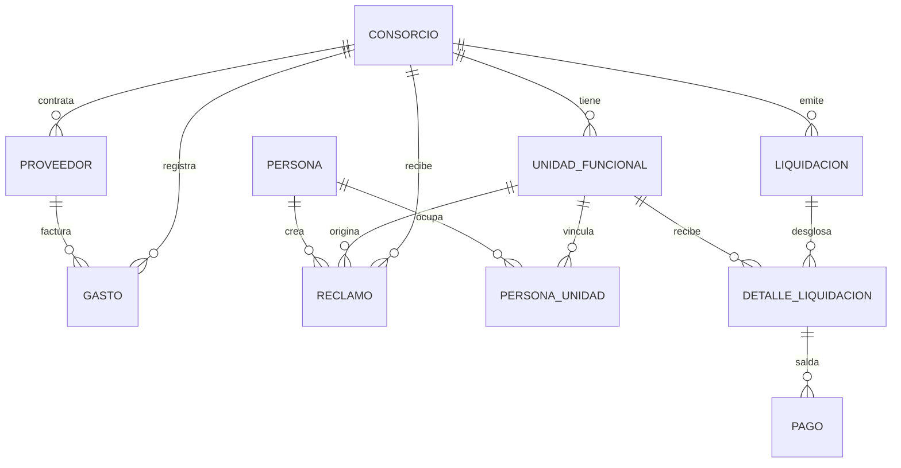

# Propuesta integral — SaaS de Administración de Consorcios (Propiedad Horizontal, Argentina)

**Fecha de elaboración:** 2026-08-12
**Alcance geográfico:** Argentina (nacional, con variaciones provinciales/municipales a validar)
**Estado:** Borrador de trabajo — requiere validación legal, técnica y comercial antes de comprometerse con clientes o inversores.

> **Nota de método (leer antes de usar este documento):** por instrucción expresa, este documento **no inventa** leyes, normas, integraciones disponibles, precios de mercado ni cifras. Toda afirmación normativa o verificable indica su fuente/organismo, jurisdicción y el hecho de que requiere confirmación con fecha de consulta actual (este documento no tuvo acceso a búsqueda web en el momento de redactarse). Cuando falta un dato crítico, se declara como supuesto explícito. El producto **no debe presentarse como legalmente cumplidor** ni "listo para operar" hasta validar los puntos marcados como `[VERIFICAR]`.

Leyenda usada en todo el documento:
- `[HECHO]` — hecho verificado con fuente citada.
- `[CONOCIMIENTO GENERAL – VERIFICAR VIGENCIA]` — información de dominio público razonablemente estable, pero no confirmada en esta sesión (sin acceso a fuente oficial actualizada); debe reconfirmarse antes de usar en materiales legales o comerciales.
- `[INFERENCIA]` — deducción razonable del equipo, no un hecho.
- `[SUPUESTO]` — hipótesis de trabajo que reemplaza un dato faltante; debe validarse.
- `[RIESGO]` — riesgo identificado.
- `[VERIFICAR]` — dato crítico pendiente de confirmación antes de avanzar.

---

## 0. Resumen ejecutivo

Un SaaS vertical para administradores de consorcios (propiedad horizontal) en Argentina, que digitaliza liquidación de expensas, cobranzas, comunicación con propietarios, gestión de proveedores/reclamos y trazabilidad de asambleas. El objetivo del MVP es reemplazar la planilla de cálculo + WhatsApp + recibos en papel que hoy usa la mayoría de administradores independientes y pequeños estudios `[INFERENCIA]`, con un producto operable por un equipo reducido y presupuesto inicial acotado (`[SUPUESTO]`: 1–3 personas técnicas + 1 comercial en los primeros 6–9 meses).

---

## 1. Problema, cliente objetivo y propuesta de valor

### 1.1 Problema
- Los administradores de consorcios en Argentina —especialmente independientes y estudios chicos/medianos (`[SUPUESTO]`: 1 a 60 consorcios administrados)— hoy operan mayormente con planillas de Excel, WhatsApp, transferencias/efectivo y recibos manuales `[INFERENCIA, basada en práctica del sector — requiere validación con entrevistas a administradores]`.
- Esto genera: errores de liquidación, mora difícil de trazar, falta de transparencia frente a propietarios (fuente de conflictos y juicios), pérdida de historial ante rotación de administrador, y alto costo operativo por consorcio administrado.
- El propietario/consorcista, por su parte, no tiene visibilidad clara de en qué se gasta la expensa ni canal formal de reclamo — fuente de litigiosidad `[INFERENCIA]`.

### 1.2 Cliente objetivo (ICP)
| Segmento | Descripción | Prioridad MVP |
|---|---|---|
| Administrador profesional independiente | 1 persona o estudio chico, gestiona entre ~5 y ~40 consorcios `[SUPUESTO]` | Alta — primer foco |
| Estudio de administración mediano | Equipo de 2–10 personas, 40–150 consorcios `[SUPUESTO]` | Media — fase 2 |
| Consorcio autoadministrado | Consejo de propietarios sin administrador profesional | Baja — nicho, requiere UX distinta |
| Grandes administradoras / cadenas | +150 consorcios, ya con sistemas propios o ERP | Fuera de foco inicial — ciclo de venta largo, requiere integraciones complejas |

`[VERIFICAR]`: tamaño real de mercado (cantidad de consorcios/administradores registrados en Argentina) — no se dispone de cifra verificada; **no se debe publicar ningún TAM/SAM/SOM sin fuente**.

### 1.3 Propuesta de valor
- Para el administrador: reduce tiempo de liquidación mensual, minimiza errores, centraliza comunicación y documentación, y da trazabilidad/auditoría ante conflictos.
- Para el propietario: visibilidad de expensas, historial de pagos, canal de reclamos y acceso a documentación de asamblea.
- Diferenciación propuesta: producto simple, en español, pensado para el flujo argentino de expensas (ordinarias/extraordinarias, fondo de reserva, prorrateo por porcentual `[CONOCIMIENTO GENERAL – VERIFICAR VIGENCIA]`), con curva de adopción baja para un administrador no técnico.

`[VERIFICAR]`: comparación competitiva (jerárquicamente: qué ofrecen hoy actores existentes del segmento "software de administración de consorcios en Argentina"). No se listan competidores por nombre en este documento porque no hay verificación de sus funcionalidades/precios actuales — **se recomienda como tarea previa al roadmap comercial (ver sección 11) hacer relevamiento propio**.

---

## 2. Alcance del MVP

### 2.1 Incluido en el MVP
1. Alta de consorcio, unidades funcionales y propietarios/inquilinos.
2. Carga de gastos y liquidación mensual de expensas (ordinarias) con prorrateo por porcentual de cada unidad.
3. Emisión de liquidación/cupón de pago por unidad (PDF descargable).
4. Registro de cobranzas (pago manual/conciliación) y estado de cuenta por unidad (al día / en mora).
5. Panel del propietario (solo lectura): ver su expensa, historial de pagos, documentos publicados.
6. Comunicaciones básicas: publicación de avisos/circulares visibles para todos los propietarios de un consorcio.
7. Reclamos: alta de reclamo por el propietario, seguimiento de estado por el administrador.
8. Registro de proveedores y gastos asociados (sin conciliación bancaria automática en MVP).
9. Exportación de datos (CSV/PDF) por consorcio y período.
10. Roles básicos: administrador, propietario, (opcional) consejo de administración con permisos de solo lectura ampliada.

### 2.2 Explícitamente excluido del MVP
- Cobro online integrado (pasarela de pago) — se define en fase 2 (ver sección 3 y 7).
- Conciliación bancaria automática.
- Firma digital/electrónica de actas de asamblea.
- Videoconferencia o votación en línea para asambleas.
- App móvil nativa (se prioriza web responsive).
- Facturación electrónica / integración AFIP.
- Multi-moneda, multi-país.
- Motor de reportes financieros avanzados (contabilidad completa, balances).
- Firma y gestión de contratos de proveedores.

### 2.3 Criterios de aceptación medibles (MVP)
| # | Criterio | Medición |
|---|---|---|
| 1 | Un administrador puede dar de alta un consorcio completo (unidades + propietarios) | Tiempo ≤ 30 min para un consorcio de 20 unidades, sin soporte, tras onboarding guiado — `[SUPUESTO]` de umbral, ajustar con test de usuario |
| 2 | Liquidación mensual generada sin intervención manual de cálculo | 100% de las unidades de un consorcio con prorrateo correcto según % cargado (verificado contra cálculo manual de control) |
| 3 | Propietario visualiza su estado de cuenta actualizado | Disponible en panel dentro de las 24 h de publicada la liquidación |
| 4 | Reclamo cargado por propietario es visible al administrador | Latencia ≤ 5 min (tiempo real o casi real) |
| 5 | Exportación de liquidación en PDF | Documento descargable, con desglose de ítems y porcentual, en 100% de los casos de prueba |
| 6 | Disponibilidad del servicio | `[SUPUESTO]` objetivo interno 99% mensual durante beta — no comprometer contractualmente hasta tener infraestructura validada |

---

## 3. Roadmap priorizado por fases

`[SUPUESTO]` general: equipo de 2 desarrolladores + 1 producto/diseño part-time + 1 comercial desde fase 2. Duraciones son estimaciones de trabajo, no compromisos — deben ajustarse tras spike técnico inicial.

| Fase | Objetivo | Entregables clave | Dependencias | Criterio de salida |
|---|---|---|---|---|
| **0. Descubrimiento** (`[SUPUESTO]` 3–4 semanas) | Validar problema y flujo real de liquidación con administradores reales | ≥8 entrevistas a administradores; mapa de flujo actual de liquidación; lista de features priorizadas | Acceso a administradores para entrevistar | Consenso interno sobre alcance de MVP validado con al menos 3 potenciales usuarios piloto |
| **1. MVP** (`[SUPUESTO]` 8–12 semanas) | Producto funcional con el alcance de la sección 2.1 | App web funcional; onboarding guiado; liquidación + panel propietario + reclamos | Definición de reglas de prorrateo confirmada con administradores piloto | 2–3 consorcios reales corriendo una liquidación completa en la plataforma sin intervención manual paralela |
| **2. Cobros y pagos** (`[SUPUESTO]` 6–10 semanas) | Cerrar el ciclo de cobranza | Integración con pasarela de pago (a definir, ver sección 7); conciliación semi-automática; recordatorios de mora | Selección y `[VERIFICAR]` validación técnica/comercial de proveedor de pagos | ≥1 consorcio piloto cobrando expensas 100% a través de la plataforma durante 2 ciclos consecutivos |
| **3. Asambleas y comunicación avanzada** (`[SUPUESTO]` 6–8 semanas) | Formalizar gobierno del consorcio | Convocatoria a asamblea, registro de asistencia/quórum, actas (sin firma digital aún), encuestas/consultas simples | Fase 1 estable | Un consorcio piloto realiza una asamblea con convocatoria y acta gestionadas en plataforma |
| **4. Escalado operativo** (`[SUPUESTO]` continuo desde mes ~9) | Soportar estudios medianos (40–150 consorcios) | Multi-usuario por estudio, permisos por consorcio, reportes consolidados, mejoras de performance | Volumen real de datos de fase 1–3 | Un estudio con ≥30 consorcios operando sin degradación de performance perceptible |
| **5. Integraciones y compliance ampliado** (`[SUPUESTO]` a definir según demanda) | Reducir fricción operativa y cerrar brechas normativas identificadas | Conciliación bancaria automática, facturación electrónica (`[VERIFICAR]` factibilidad AFIP), firma electrónica de actas | Resultado de validación legal (sección 8) y de integraciones (sección 7) | Depende de qué integraciones resulten viables y demandadas — a re-priorizar con datos reales |

---

## 4. Módulos, roles, permisos, entidades principales y reglas de negocio

### 4.1 Módulos
1. **Consorcios y unidades** — ABM de consorcios, unidades funcionales, porcentuales.
2. **Personas** — propietarios, inquilinos, consejo de administración, administrador, proveedores.
3. **Liquidación de expensas** — carga de gastos, cálculo de prorrateo, emisión de cupones.
4. **Cobranzas** — registro de pagos, estado de cuenta, mora.
5. **Comunicaciones** — avisos, circulares, notificaciones.
6. **Reclamos** — alta, seguimiento, cierre.
7. **Proveedores y gastos** — ABM de proveedores, carga de comprobantes/gastos asociados a rubros.
8. **Asambleas** (fase 3) — convocatoria, quórum, actas.
9. **Reportes** — estado de cuenta por unidad, resumen por consorcio, exportables.
10. **Administración de la plataforma** — usuarios, roles, auditoría, configuración por consorcio.

### 4.2 Roles y permisos (propuesta inicial)
| Rol | Alcance | Permisos clave |
|---|---|---|
| Superadmin (equipo del SaaS) | Toda la plataforma | Soporte, configuración global, no debería tener acceso irrestricto a datos financieros de clientes sin trazabilidad (ver auditoría, sección 6) |
| Administrador de consorcio | Uno o varios consorcios asignados | ABM completo de su(s) consorcio(s): unidades, gastos, liquidaciones, comunicaciones, reclamos, proveedores |
| Colaborador de estudio | Subconjunto de consorcios de un estudio | Permisos configurables por consorcio (lectura/escritura) — pensado para fase 4 |
| Consejo de administración | Uno o varios consorcios | Lectura ampliada: gastos, liquidaciones, documentos; sin edición |
| Propietario/inquilino | Su(s) unidad(es) | Lectura de su estado de cuenta, documentos publicados, alta de reclamos propios |

`[SUPUESTO]`: el modelo de permisos por consorcio (no solo por rol global) es necesario desde el MVP porque un mismo administrador gestiona múltiples consorcios con datos que no deben cruzarse — esto es un requisito de diseño, no solo de negocio.

### 4.3 Entidades principales (modelo conceptual, no exhaustivo)
`Consorcio` — `UnidadFuncional` (pertenece a un Consorcio, tiene % de propiedad) — `Persona` (puede ser Propietario, Inquilino, Proveedor, Administrador; se relaciona con UnidadFuncional o Consorcio) — `Gasto` (asociado a Consorcio, rubro, proveedor, período) — `Liquidación` (por Consorcio y período, agrega Gastos y genera `DetalleLiquidación` por UnidadFuncional según %) — `Pago` (asociado a UnidadFuncional y Liquidación/período) — `Reclamo` (asociado a UnidadFuncional o Consorcio) — `Comunicación` (asociada a Consorcio, visible a Personas relacionadas) — `Asamblea` (fase 3, asociada a Consorcio).

### 4.4 Reglas de negocio clave (a validar con administradores reales — no asumir como definitivas)
- El prorrateo de expensas ordinarias se calcula, salvo excepción cargada, según el porcentual de cada unidad funcional sobre el total del consorcio `[CONOCIMIENTO GENERAL – VERIFICAR VIGENCIA respecto del reglamento de copropiedad de cada consorcio, que puede fijar reglas distintas]`.
- Gastos extraordinarios y fondo de reserva pueden tener reglas de prorrateo distintas a las ordinarias, configurables por consorcio `[SUPUESTO — debe validarse contra reglamentos reales]`.
- Un propietario en mora no debería perder acceso de lectura a su propio estado de cuenta (principio de transparencia) `[INFERENCIA de buena práctica, no obligación normativa verificada]`.
- Cambios en el porcentual de una unidad, o en el padrón de propietarios, deben quedar con historial auditable (fecha, usuario que hizo el cambio, valor anterior/nuevo) — requisito de diseño para litigios futuros.

---

## 5. Flujos operativos clave

### 5.1 Alta de consorcio
1. Administrador crea el consorcio (datos básicos, dirección, CUIT si aplica `[VERIFICAR]` si se requiere para facturación).
2. Carga de unidades funcionales y porcentuales (idealmente importación desde planilla, no solo carga manual, dado que es fricción alta en onboarding — `[INFERENCIA]`, priorizar en MVP si el spike técnico lo permite).
3. Carga/invitación de propietarios e inquilinos por unidad.
4. Configuración de rubros de gasto habituales del consorcio.

### 5.2 Liquidación y expensas
1. Administrador carga gastos del período (proveedor, rubro, importe, comprobante opcional).
2. Sistema calcula prorrateo por unidad según reglas configuradas (4.4).
3. Administrador revisa y publica la liquidación (no debería publicarse automáticamente sin revisión humana en el MVP — control de calidad).
4. Se genera cupón/PDF por unidad y notificación a propietarios.

### 5.3 Cobranzas y pagos
- MVP: registro manual de pago (transferencia, efectivo) por el administrador, con actualización de estado de cuenta.
- Fase 2: integración con pasarela de pago para que el propietario pague desde el panel (sección 7 — `[VERIFICAR]` factibilidad técnica/comercial y costos de la pasarela elegida).
- Mora: definición de reglas de aviso (recordatorios) — `[SUPUESTO]` de plazos, deben configurarse por consorcio, no hardcodearse.

### 5.4 Proveedores
- ABM de proveedores con datos de contacto y rubro.
- Asociación de gastos a proveedor y comprobante (imagen/PDF adjunto).
- Fuera del MVP: gestión de contratos, evaluación de proveedores, pagos a proveedores desde la plataforma.

### 5.5 Reclamos
1. Propietario carga reclamo (categoría, descripción, adjunto opcional).
2. Administrador recibe notificación, cambia estado (recibido → en curso → resuelto).
3. Historial visible para el propietario que lo cargó; visibilidad a otros propietarios `[SUPUESTO — a definir, hay tensión entre transparencia y privacidad, requiere decisión de producto]`.

### 5.6 Asambleas (fase 3)
1. Convocatoria con orden del día, fecha, lugar/modalidad.
2. Registro de asistencia y cálculo de quórum según porcentuales presentes `[CONOCIMIENTO GENERAL – VERIFICAR VIGENCIA respecto de reglas de quórum, que dependen del reglamento de copropiedad y de la normativa de fondo]`.
3. Redacción y publicación de acta (sin firma electrónica en fase 3 — ver sección 3).

### 5.7 Comunicaciones y reportes
- Publicación de avisos/circulares por consorcio, visibles según rol.
- Reportes: estado de cuenta por unidad, resumen de gastos por rubro y período, exportables en PDF/CSV.

---

## 6. Arquitectura técnica, stack sugerido, seguridad, backups, auditoría, privacidad y escalabilidad

`[SUPUESTO general]`: se prioriza time-to-market y mantenibilidad por un equipo chico por sobre arquitectura "enterprise" desde el día uno.

### 6.1 Stack sugerido (propuesta, no obligación — debe validarse contra las capacidades reales del equipo)
- **Backend:** framework web con ORM maduro (p. ej. Node.js/TypeScript o Python) — la elección concreta debe basarse en el stack que el equipo disponible domine mejor, no en preferencia abstracta.
- **Base de datos:** relacional (PostgreSQL) — el dominio (liquidaciones, prorrateos, historial financiero) es fuertemente relacional y requiere integridad transaccional.
- **Frontend:** aplicación web responsive (SPA o framework SSR) accesible desde navegador móvil, dado que MVP no incluye app nativa.
- **Generación de PDF:** librería de renderizado server-side para cupones/liquidaciones.
- **Hosting:** proveedor cloud con datacenter con soporte de residencia de datos razonable (`[VERIFICAR]` si existe requisito normativo de localización de datos personales en Argentina aplicable a este producto — ver sección 8).

### 6.2 Seguridad
- Autenticación con contraseña + hash seguro (bcrypt/argon2) y, deseable desde MVP, opción de segundo factor para administradores (no imprescindible para propietarios en MVP).
- Control de acceso por consorcio a nivel de backend (no solo en la interfaz) — crítico dado el modelo multi-tenant (sección 4.2).
- Cifrado en tránsito (HTTPS/TLS) obligatorio desde el día uno.
- Cifrado en reposo de datos sensibles (`[VERIFICAR]` alcance concreto según clasificación de datos personales, sección 8).
- Gestión de secretos fuera del código fuente (variables de entorno / secret manager del proveedor cloud).

### 6.3 Backups y continuidad
- Backups automáticos de base de datos con frecuencia mínima diaria y retención `[SUPUESTO]` de al menos 30 días, a definir según capacidad de almacenamiento y costo.
- Prueba periódica de restauración (no solo generar backup, sino validar que se puede restaurar) — práctica recomendada, a formalizar en fase 1.

### 6.4 Auditoría
- Log de auditoría para acciones sensibles: alta/baja/modificación de unidades, propietarios, gastos, liquidaciones y cambios de permisos — quién, cuándo, qué valor antes/después (ver 4.4).
- Retención del log de auditoría separada de la retención de backups operativos, dado su valor probatorio ante conflictos.

### 6.5 Privacidad y datos personales
- El producto procesa datos personales (nombres, contacto, y potencialmente datos de pago) de propietarios e inquilinos — esto activa obligaciones de protección de datos personales en Argentina `[CONOCIMIENTO GENERAL – VERIFICAR VIGENCIA]` (existe un marco nacional de protección de datos personales cuyo órgano de aplicación corresponde validar formalmente — ver sección 8, marcado `[VERIFICAR]` con detalle).
- Minimizar datos recolectados a lo estrictamente necesario para el MVP (evitar capturar datos sensibles no requeridos, p. ej. no pedir DNI si no es indispensable en esta etapa).

### 6.6 Escalabilidad
- Diseño multi-tenant desde el modelo de datos (aislamiento lógico por consorcio/estudio), aunque la infraestructura inicial puede ser mono-instancia — la separación lógica evita una migración costosa después.
- Escalado vertical simple es suficiente para el volumen esperado en fases 0–3 (`[SUPUESTO]`, decenas a pocos cientos de consorcios); revisar arquitectura si se proyecta escalar a miles de consorcios o a más de un país.

---

## 7. Integraciones necesarias y opcionales

| Integración | Tipo | Fase sugerida | Validación requerida |
|---|---|---|---|
| Pasarela de pagos (cobro de expensas online) | Necesaria para cerrar el ciclo de cobranza | Fase 2 | `[VERIFICAR]` técnica (API, webhooks, conciliación) y comercial (costos por transacción, tiempo de acreditación) — no se nombra proveedor específico sin validar condiciones vigentes |
| Envío de notificaciones (email/WhatsApp/SMS) | Necesaria para avisos y recordatorios | MVP (email como mínimo) | `[VERIFICAR]` costos y límites de proveedor de mensajería elegido; WhatsApp Business API requiere validación comercial y de cumplimiento de políticas de la plataforma |
| Conciliación bancaria automática | Opcional / mejora de eficiencia | Fase 5 | `[VERIFICAR]` factibilidad técnica según banco/formato de archivo, y si requiere acuerdos comerciales con bancos |
| Facturación electrónica | Opcional, depende de si el SaaS facturará expensas "en nombre de" el consorcio o solo del lado del propietario final | Fase 5 | `[VERIFICAR]` alcance normativo y técnico — requiere validación legal/impositiva especializada, no asumir aplicabilidad ni forma de implementación |
| Firma electrónica de actas | Opcional | Fase 5 o posterior | `[VERIFICAR]` validez legal de la firma electrónica para actas de asamblea de consorcio en Argentina — requiere validación legal específica, no asumir equivalencia con firma digital certificada |
| Almacenamiento de documentos (comprobantes, actas) | Necesaria | MVP | Validación técnica menor (proveedor de almacenamiento cloud estándar) |

---

## 8. Cumplimiento normativo aplicable en Argentina

**Esta sección es la de mayor riesgo de imprecisión y debe tratarse como un mapa de preguntas a validar con asesoría legal especializada, no como fuente normativa.** No se citan artículos ni números de ley con pretensión de exactitud sin marcar explícitamente el nivel de certeza.

| Ámbito | Nivel | Qué hay que validar | Estado |
|---|---|---|---|
| Régimen de propiedad horizontal (definición de consorcio, expensas, asambleas, quórum, fondo de reserva) | Nacional | Existe un marco de fondo en el derecho civil y comercial argentino que regula la propiedad horizontal `[CONOCIMIENTO GENERAL – VERIFICAR VIGENCIA]`; hay que confirmar texto vigente, artículos aplicables y actualizaciones recientes con fuente oficial (p. ej. sitio de Servicios de Información Legislativa u organismo equivalente) | `[VERIFICAR]` |
| Habilitación/registro de administradores de consorcio | Provincial/municipal (varía por jurisdicción) | En al menos una jurisdicción del país existe, según conocimiento general, un régimen de registro/habilitación de administradores `[CONOCIMIENTO GENERAL – VERIFICAR VIGENCIA]`; **no asumir que aplica igual en todas las provincias/municipios** — debe relevarse jurisdicción por jurisdicción antes de vender el producto allí | `[VERIFICAR]` |
| Protección de datos personales | Nacional | Existe un marco de protección de datos personales en Argentina con un órgano de aplicación `[CONOCIMIENTO GENERAL – VERIFICAR VIGENCIA]`; deben confirmarse obligaciones concretas (registro de bases de datos, consentimiento, derechos de los titulares, transferencias internacionales si el hosting está fuera del país) | `[VERIFICAR]` |
| Facturación / régimen impositivo de expensas | Nacional (AFIP y régimen local) | Si el SaaS interviene en la emisión de comprobantes de cobro de expensas, hay que definir si eso genera obligaciones fiscales propias o del consorcio/administrador, y si corresponde algún tipo de comprobante específico | `[VERIFICAR]` — requiere asesoría contable/impositiva |
| Defensa del consumidor (relación administrador–propietario, y SaaS–cliente administrador) | Nacional | Aplicabilidad del marco de protección al consumidor a los contratos de servicio del SaaS y, potencialmente, a la relación administrador-propietario | `[VERIFICAR]` |
| Terminación/portabilidad de datos al cambiar de administrador o de proveedor de software | No es un requisito normativo identificado con certeza, pero es una expectativa razonable del mercado | Definir contractualmente cómo se entregan los datos históricos si un consorcio cambia de administrador o de plataforma | `[INFERENCIA — buena práctica, no obligación confirmada]` |

**Regla operativa mientras estos puntos no estén validados:** no incluir en materiales de venta ni en el producto ninguna afirmación de tipo "cumple con la ley X" o "está homologado por Y". Comunicar el producto como herramienta de gestión, dejando la responsabilidad de cumplimiento normativo sustantivo en cabeza del administrador profesional, hasta que se confirme cada punto de esta tabla.

---

## 9. Modelo de negocio, segmentos, pricing, costos y estrategia de ventas B2B

### 9.1 Modelo de negocio propuesto
- SaaS B2B, venta al **administrador** (o estudio), no directamente al propietario final — el propietario es usuario del panel de lectura, no el que paga la suscripción `[SUPUESTO — validar si eventualmente hay un modelo mixto donde el consorcio paga como gasto común]`.
- Cobro recurrente, `[SUPUESTO]` mensual, con métrica de precio a definir (ver 9.2).

### 9.2 Métrica de pricing — opciones a evaluar (sin definir precio, porque no hay dato de mercado verificado)
| Opción de métrica | Ventaja | Riesgo |
|---|---|---|
| Precio por consorcio administrado | Escala con el uso real, fácil de entender | Puede desincentivar dar de alta consorcios chicos |
| Precio por unidad funcional total gestionada | Refleja mejor el volumen de datos/transacciones | Más complejo de comunicar y facturar |
| Plan por tramos (cantidad de consorcios) | Simplicidad comercial | Menos preciso, puede dejar valor sobre la mesa o sobreprecio en el borde de cada tramo |

`[VERIFICAR]`: no se propone un número de precio concreto porque no hay validación de disposición a pagar del segmento ni de precios de referencia de mercado — **se recomienda testear precio con los pilotos de la fase 0/1, no fijarlo a priori**.

### 9.3 Costos supuestos (no cifras — solo categorías, a presupuestar con datos reales del equipo)
- Costo de desarrollo (equipo fase 0–3).
- Costo de infraestructura cloud (crece con consorcios/usuarios activos).
- Costo de mensajería (email/WhatsApp) — variable por volumen.
- Costo de pasarela de pagos (fase 2) — típicamente un % por transacción, `[VERIFICAR]` con proveedor concreto.
- Costo comercial (tiempo de ventas, materiales, eventualmente asesoría legal para sección 8).

### 9.4 Estrategia de ventas B2B (para equipo chico)
1. **Fase 0–1:** ventas manuales, uno a uno, con administradores conocidos o referidos — objetivo es aprendizaje, no volumen.
2. **Fase 2–3:** casos de éxito documentados de los pilotos como contenido de venta (con permiso explícito del cliente); posible participación en espacios donde se reúnen administradores (colegios/cámaras del sector, si existen y son accesibles — `[VERIFICAR]` cuáles existen y si tienen actividad relevante para esto).
3. **Canal:** venta directa (no marketplace ni canal indirecto en el MVP, por simplicidad operativa de un equipo chico).
4. **Retención como palanca de crecimiento:** dado que el cliente administra múltiples consorcios, cada cliente retenido tiene alto valor de expansión (más consorcios del mismo estudio) — priorizar retención sobre adquisición agresiva en las primeras fases.

---

## 10. Riesgos y mitigaciones

| Riesgo | Tipo | Impacto | Mitigación propuesta |
|---|---|---|---|
| Errores de cálculo en liquidación de expensas | Producto | Alto — pérdida de confianza, potencial conflicto legal para el cliente | Validación cruzada contra cálculo manual en pilotos; tests automatizados sobre reglas de prorrateo; revisión humana obligatoria antes de publicar liquidación (MVP) |
| Incumplimiento normativo no detectado (sección 8) | Legal | Alto | No comunicar cumplimiento hasta validar; contratar revisión legal puntual antes de escalar comercialmente; incluir cláusulas contractuales claras sobre responsabilidad del administrador |
| Fuga o filtración de datos personales/financieros | Legal / reputacional | Alto | Medidas de seguridad de sección 6.2; política de privacidad clara; plan de respuesta a incidentes desde fase 1 |
| Dependencia de un proveedor de pagos que luego no valida comercialmente | Operativo/comercial | Medio-alto (bloquea fase 2) | Evaluar más de una opción de pasarela antes de comprometer roadmap; no anunciar fecha de "pagos online" a clientes hasta tener validación técnica |
| Baja adopción por resistencia al cambio de administradores (usuarios poco técnicos) | Comercial/producto | Alto | Onboarding asistido en pilotos; UX simplificada; soporte cercano en fase 0–2 |
| Concentración de conocimiento en poco personal (equipo chico) | Operativo | Medio | Documentación técnica desde el inicio; evitar dependencias críticas de una sola persona sin backup |
| Litigio de un propietario/consorcio por un error atribuible a la plataforma | Legal | Alto pero de baja probabilidad si hay controles | Términos de servicio claros sobre alcance de responsabilidad; log de auditoría (6.4) como respaldo probatorio; revisión legal de contrato de servicio |
| Estimaciones de roadmap y costos basadas en supuestos no validados | Implementación | Medio | Re-planificar al cierre de fase 0 (descubrimiento) con datos reales, no mantener el roadmap inicial como fijo |

---

## 11. Plan de lanzamiento y métricas de éxito

### 11.1 Plan de lanzamiento (orientativo)
1. Fase 0 (descubrimiento) → selección de 2–3 consorcios/administradores piloto con relación de confianza (para tolerar fricción de un producto nuevo).
2. Fase 1 (MVP) → onboarding manual y acompañado de los pilotos; sin lanzamiento público todavía.
3. Cierre de fase 1 → recolección de feedback estructurado, ajuste de producto.
4. Fase 2 en adelante → ampliar a más administradores por referencia directa de los pilotos, antes de cualquier esfuerzo de marketing masivo (que no está presupuestado ni definido en este documento).

### 11.2 Métricas de éxito (medibles, sin cifras objetivo inventadas — los umbrales deben fijarse tras fase 0 con datos reales)
| Área | Métrica | Nota |
|---|---|---|
| Producto | % de liquidaciones publicadas sin corrección posterior | Indicador de confiabilidad del cálculo |
| Producto | Tiempo promedio de liquidación mensual por consorcio (antes vs. después de adoptar el SaaS) | Requiere medición baseline en fase 0 (entrevistas) |
| Ventas | Cantidad de consorcios activos gestionados en plataforma | Métrica core de tracción |
| Ventas | Tasa de conversión de piloto a cliente pago | A partir de fase 2, cuando exista modelo de cobro definido |
| Retención | Churn mensual de administradores/estudios clientes | Crítico dado el modelo de expansión por cliente (9.4) |
| Retención | Cantidad de consorcios adicionales dados de alta por un mismo cliente existente | Mide expansión dentro de cuenta |
| Soporte | Tiempo de respuesta a tickets/reclamos de administradores | `[SUPUESTO]` de umbral a definir según capacidad real del equipo de soporte |
| Soporte | % de reclamos de propietarios resueltos dentro del plazo que cada consorcio configure | Depende de la configuración de cada cliente, no de un SLA global inventado |

`[VERIFICAR]` / **acción recomendada**: fijar valores objetivo concretos (p. ej. "≥70% conversión piloto→pago") recién después de tener datos reales de fase 0–1; publicar objetivos numéricos sin esa base sería una cifra inventada, lo cual está expresamente prohibido por las reglas de este encargo.

---

## Anexo A — Síntesis: hechos verificados, inferencias, riesgos y datos a verificar

- **Hechos verificados (`[HECHO]`):** ninguno en este documento tiene fuente oficial citada con fecha de consulta, porque esta sesión no tuvo acceso a búsqueda web/documental al momento de redactarlo. **Antes de publicar o comercializar, todo punto marcado `[CONOCIMIENTO GENERAL – VERIFICAR VIGENCIA]` o `[VERIFICAR]` debe convertirse en `[HECHO]` con fuente, organismo emisor, jurisdicción y fecha de consulta, o descartarse.**
- **Inferencias (`[INFERENCIA]`):** supuestos razonables sobre el comportamiento actual de administradores (uso de Excel/WhatsApp), necesidad de transparencia para el propietario, y buenas prácticas de producto — deben confirmarse con las entrevistas de fase 0.
- **Riesgos:** detallados en sección 10, con foco especial en el riesgo legal/normativo (sección 8), que es el de mayor impacto potencial y el que más requiere validación externa antes de avanzar comercialmente.
- **Datos que requieren verificación crítica antes de cualquier lanzamiento comercial:**
  1. Vigencia y texto exacto de la normativa de propiedad horizontal aplicable (nacional).
  2. Existencia y alcance de regímenes de habilitación de administradores por jurisdicción (provincial/municipal).
  3. Obligaciones concretas de protección de datos personales aplicables al producto.
  4. Implicancias fiscales de intervenir en la emisión de comprobantes de expensas.
  5. Viabilidad técnica y comercial concreta de la pasarela de pagos elegida.
  6. Tamaño de mercado, competidores activos y sus precios/funcionalidades actuales.
  7. Disposición a pagar real del segmento objetivo (para fijar pricing).

## Anexo B — Preguntas de validación sugeridas para la fase 0

1. ¿Cuántos consorcios administra hoy en promedio un administrador independiente en el segmento objetivo, y con qué herramientas liquida hoy?
2. ¿Qué reglas de prorrateo usan realmente (ordinario, extraordinario, fondo de reserva) y cuánto varían entre consorcios?
3. ¿Qué proporción de la cobranza hoy es por transferencia vs. efectivo vs. otro medio?
4. ¿Existe hoy algún régimen de habilitación/registro que el administrador deba cumplir en su jurisdicción, y cómo lo acredita?
5. ¿Qué nivel de confianza tendría un administrador en delegar el cálculo de liquidación a un sistema nuevo, y qué controles pediría antes de confiar en él?
6. ¿Qué presupuesto mensual estaría dispuesto a destinar un administrador a este tipo de herramienta, y bajo qué métrica (por consorcio, por unidad, plan fijo)?

---

## Anexo C — Especificación técnica preliminar del MVP (borrador de ingeniería)

`[SUPUESTO]` Todo el contenido de este anexo es una **propuesta de diseño técnico**, no una implementación existente ni una decisión cerrada. Se incluye para acelerar el arranque de la fase 1 (sección 3), pero debe ser revisado y ajustado por quien lidere el desarrollo antes de escribir código — en particular las reglas de prorrateo, que varían por consorcio y reglamento (ver 4.4).

### C.1 Modelo de datos — boceto de esquema relacional

Boceto ilustrativo en SQL (PostgreSQL), pensado para validar el modelo conceptual de la sección 4.3, no como DDL final. Omite índices, particionado y auditoría detallada por brevedad — deben agregarse antes de implementar (ver 6.4).

```sql
-- Boceto de esquema — no ejecutar en producción sin revisión de ingeniería
CREATE TABLE consorcio (
    id              UUID PRIMARY KEY DEFAULT gen_random_uuid(),
    nombre          TEXT NOT NULL,
    direccion       TEXT NOT NULL,
    cuit            TEXT,                    -- [VERIFICAR] si es obligatorio para facturación (sección 7)
    creado_en       TIMESTAMPTZ NOT NULL DEFAULT now()
);

CREATE TABLE unidad_funcional (
    id              UUID PRIMARY KEY DEFAULT gen_random_uuid(),
    consorcio_id    UUID NOT NULL REFERENCES consorcio(id),
    identificador   TEXT NOT NULL,            -- ej. "UF 12", "PB A"
    porcentual      NUMERIC(6,4) NOT NULL,    -- % de copropiedad; suma por consorcio debe validarse = 100.0000
    UNIQUE (consorcio_id, identificador)
);

CREATE TABLE persona (
    id              UUID PRIMARY KEY DEFAULT gen_random_uuid(),
    nombre          TEXT NOT NULL,
    email           TEXT,
    telefono        TEXT,
    creado_en       TIMESTAMPTZ NOT NULL DEFAULT now()
);

-- Relación N:M entre persona y unidad_funcional, con rol explícito
CREATE TABLE persona_unidad (
    persona_id          UUID NOT NULL REFERENCES persona(id),
    unidad_funcional_id UUID NOT NULL REFERENCES unidad_funcional(id),
    rol                 TEXT NOT NULL CHECK (rol IN ('propietario', 'inquilino', 'consejo')),
    desde               DATE NOT NULL DEFAULT CURRENT_DATE,
    hasta               DATE,                 -- NULL = vigente; requerido para historial (ver 4.4)
    PRIMARY KEY (persona_id, unidad_funcional_id, rol, desde)
);

CREATE TABLE proveedor (
    id              UUID PRIMARY KEY DEFAULT gen_random_uuid(),
    consorcio_id    UUID NOT NULL REFERENCES consorcio(id),
    nombre          TEXT NOT NULL,
    rubro           TEXT
);

CREATE TABLE gasto (
    id              UUID PRIMARY KEY DEFAULT gen_random_uuid(),
    consorcio_id    UUID NOT NULL REFERENCES consorcio(id),
    proveedor_id    UUID REFERENCES proveedor(id),
    rubro           TEXT NOT NULL,
    tipo            TEXT NOT NULL CHECK (tipo IN ('ordinario', 'extraordinario', 'fondo_reserva')),
    importe         NUMERIC(14,2) NOT NULL,
    periodo         DATE NOT NULL,             -- primer día del mes que corresponde
    comprobante_url TEXT
);

CREATE TABLE liquidacion (
    id              UUID PRIMARY KEY DEFAULT gen_random_uuid(),
    consorcio_id    UUID NOT NULL REFERENCES consorcio(id),
    periodo         DATE NOT NULL,
    publicada_en    TIMESTAMPTZ,               -- NULL = borrador, no visible al propietario (ver 5.2)
    UNIQUE (consorcio_id, periodo)
);

CREATE TABLE detalle_liquidacion (
    id                   UUID PRIMARY KEY DEFAULT gen_random_uuid(),
    liquidacion_id       UUID NOT NULL REFERENCES liquidacion(id),
    unidad_funcional_id  UUID NOT NULL REFERENCES unidad_funcional(id),
    importe              NUMERIC(14,2) NOT NULL,   -- resultado del prorrateo para esta unidad
    UNIQUE (liquidacion_id, unidad_funcional_id)
);

CREATE TABLE pago (
    id                   UUID PRIMARY KEY DEFAULT gen_random_uuid(),
    unidad_funcional_id  UUID NOT NULL REFERENCES unidad_funcional(id),
    detalle_liquidacion_id UUID REFERENCES detalle_liquidacion(id),
    importe              NUMERIC(14,2) NOT NULL,
    medio                TEXT NOT NULL CHECK (medio IN ('transferencia', 'efectivo', 'pasarela_online')),
    registrado_en        TIMESTAMPTZ NOT NULL DEFAULT now()
);

CREATE TABLE reclamo (
    id              UUID PRIMARY KEY DEFAULT gen_random_uuid(),
    consorcio_id    UUID NOT NULL REFERENCES consorcio(id),
    unidad_funcional_id UUID REFERENCES unidad_funcional(id),
    creado_por      UUID NOT NULL REFERENCES persona(id),
    categoria       TEXT,
    descripcion     TEXT NOT NULL,
    estado          TEXT NOT NULL DEFAULT 'recibido' CHECK (estado IN ('recibido', 'en_curso', 'resuelto')),
    creado_en       TIMESTAMPTZ NOT NULL DEFAULT now()
);
```

Puntos abiertos que este boceto deja explícitamente sin resolver (marcar `[VERIFICAR]` con el equipo de desarrollo antes de implementar):
- Estrategia de multi-tenancy a nivel de fila (row-level security de Postgres vs. filtrado en capa de aplicación) — impacta directamente el control de acceso por consorcio de la sección 4.2.
- Modelo de auditoría (tabla de eventos separada vs. columnas `created_by`/`updated_by` en cada tabla) — requerido por 4.4 y 6.4.
- Si `persona_unidad` necesita soft-delete o basta con el rango `desde`/`hasta` para el historial.

### C.2 Diagrama entidad-relación (boceto)



### C.3 Endpoints REST — boceto del MVP

Boceto de superficie de API para el alcance de la sección 2.1, sin definir aún autenticación (JWT vs. sesión), formato exacto de error ni versionado — decisiones que corresponden al equipo de desarrollo.

| Método | Ruta | Propósito | Rol mínimo |
|---|---|---|---|
| `POST` | `/consorcios` | Alta de consorcio | administrador |
| `POST` | `/consorcios/{id}/unidades` | Alta de unidad funcional (o importación masiva) | administrador |
| `POST` | `/consorcios/{id}/personas` | Vincular propietario/inquilino a una unidad | administrador |
| `POST` | `/consorcios/{id}/gastos` | Cargar un gasto del período | administrador |
| `POST` | `/consorcios/{id}/liquidaciones` | Generar borrador de liquidación de un período | administrador |
| `POST` | `/liquidaciones/{id}/publicar` | Publicar liquidación (dispara notificación a propietarios) | administrador |
| `GET`  | `/liquidaciones/{id}/pdf` | Descargar cupón/liquidación en PDF | administrador, propietario (solo su unidad) |
| `GET`  | `/unidades/{id}/estado-cuenta` | Estado de cuenta de una unidad | administrador, propietario (solo su unidad) |
| `POST` | `/unidades/{id}/pagos` | Registrar un pago manual | administrador |
| `POST` | `/consorcios/{id}/reclamos` | Crear un reclamo | propietario, administrador |
| `PATCH`| `/reclamos/{id}` | Cambiar estado de un reclamo | administrador |
| `POST` | `/consorcios/{id}/comunicaciones` | Publicar un aviso/circular | administrador |

Todo endpoint que devuelva datos de una unidad funcional específica debe validar en backend que el `propietario` autenticado tenga vínculo vigente con esa unidad (`persona_unidad.hasta IS NULL`) — control que no puede delegarse al frontend, en línea con el requisito de aislamiento por consorcio de la sección 4.2.

---

*Documento de trabajo interno. No distribuir a clientes ni inversores como si fuera una propuesta legal o comercialmente cerrada hasta resolver los puntos marcados `[VERIFICAR]`. El Anexo C es un boceto de ingeniería para acelerar el arranque técnico y debe ser revisado por quien lidere el desarrollo antes de implementarse.*
